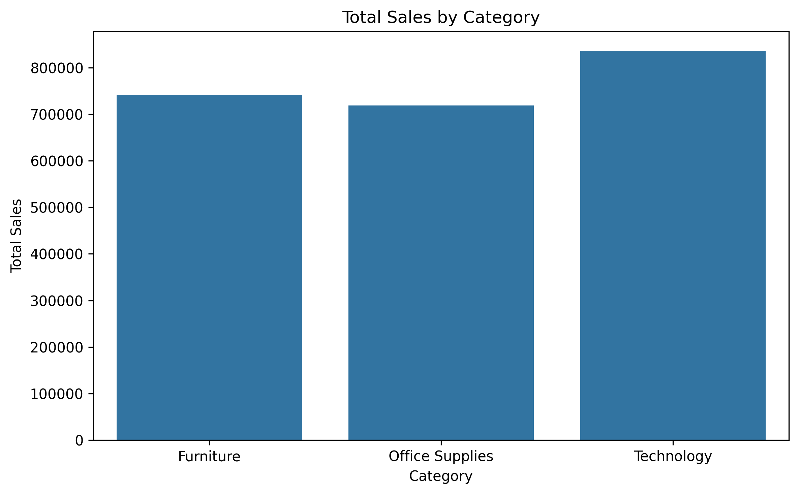
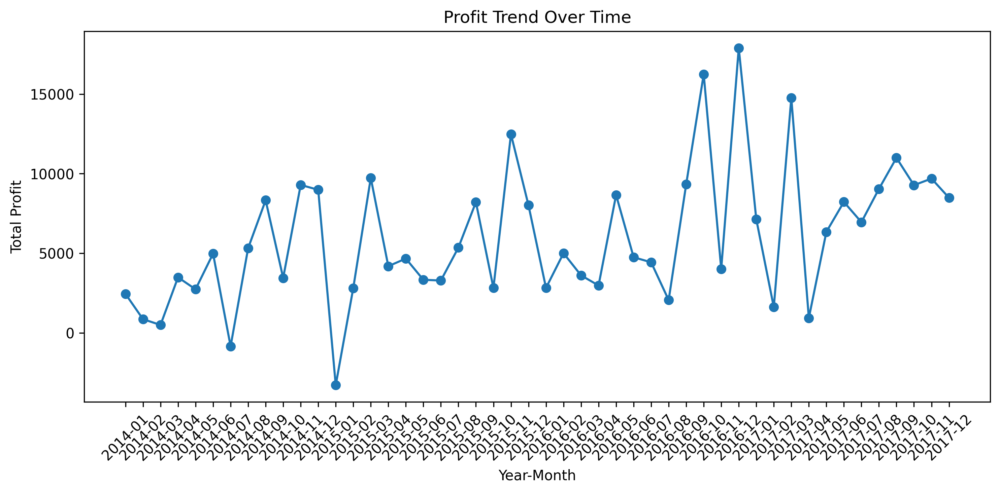
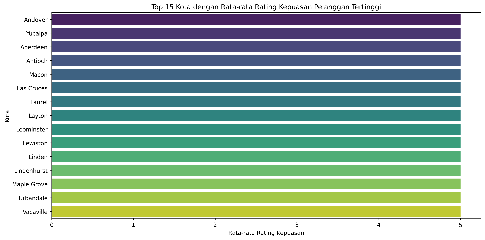
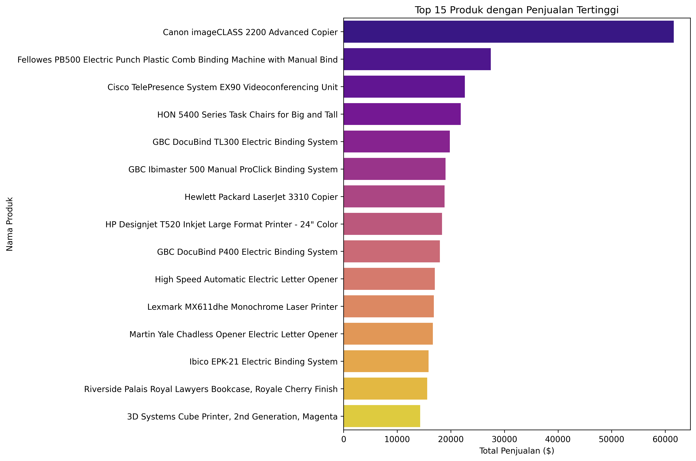
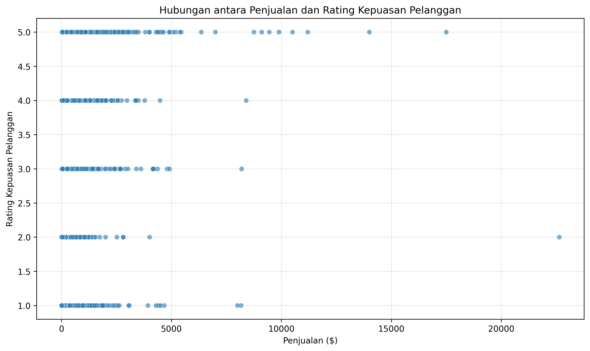
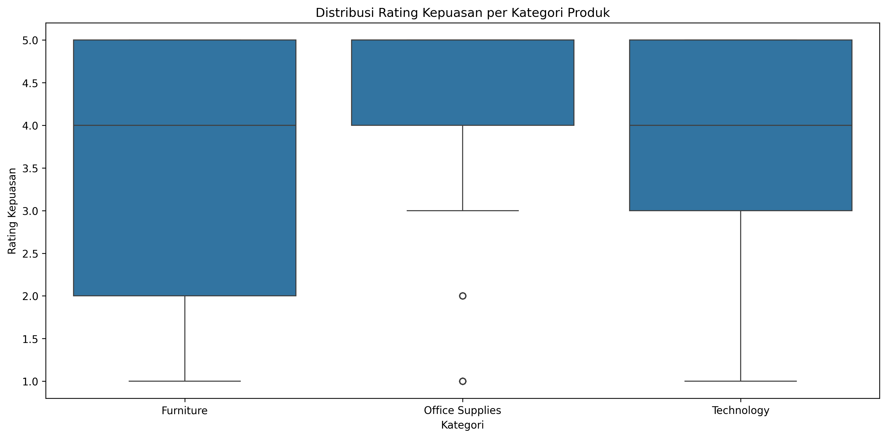

# Hasil Analisis Data Superstore - LKM Visualisasi Data

## 📋 Executive Summary

Analisis ini menggunakan dataset Superstore yang berisi 9,994 transaksi dengan 21 kolom data. Fokus analisis adalah pada tiga aspek utama sesuai requirements LKM: rating kepuasan pelanggan per kota, penjualan per produk, dan hubungan antara penjualan dengan kepuasan pelanggan.

## 🔍 Metodologi Analisis

### Dataset Overview
- **Sumber**: Kaggle Superstore Dataset
- **Periode**: 2014-2017
- **Jumlah Record**: 9,994 transaksi
- **Kolom Utama**: Sales, Profit, City, Product Name, Category, dll.

### Simulasi Rating Kepuasan
Karena dataset tidak memiliki kolom rating kepuasan pelanggan, kami membuat simulasi berdasarkan profit margin:
```python
# Logic simulasi rating
Rating 5: Profit Margin > 20%
Rating 4: Profit Margin 10-20%
Rating 3: Profit Margin 0-10%
Rating 2: Profit Margin -10-0%
Rating 1: Profit Margin < -10%
```

## 📊 Hasil Analisis Detail

### 1. Overview Bisnis Superstore



**Distribusi Penjualan per Kategori:**
- **Technology**: $836,154.03 (36.4%)
- **Furniture**: $741,999.79 (32.3%)
- **Office Supplies**: $719,047.03 (31.3%)

**Key Insights:**
- Technology menjadi kategori dengan kontribusi penjualan tertinggi
- Distribusi penjualan relatif seimbang antar ketiga kategori
- Setiap kategori berkontribusi sekitar 30-36% dari total penjualan

### 2. Trend Profit Bulanan



**Pola Profit dari Waktu ke Waktu:**
- Terdapat **pola musiman** yang jelas dalam profit
- **Puncak profit** terjadi pada bulan November-Desember (seasonal peak)
- **Profit terendah** biasanya terjadi di awal tahun
- Rata-rata profit bulanan: $5,965

**Business Implications:**
- Perusahaan perlu meningkatkan strategi marketing di Q1
- Peak season (Q4) harus dimanfaatkan maksimal
- Inventory planning harus disesuaikan dengan pola musiman

### 3. Rata-rata Rating Kepuasan Pelanggan per Kota



**Top 10 Kota dengan Rating Kepuasan Tertinggi (5.0):**
1. Andover
2. Yucaipa  
3. Aberdeen
4. Antioch
5. Macon
6. Las Cruces
7. Laurel
8. Layton
9. Leominster
10. Lewiston

**Distribusi Rating Kepuasan:**
- **Rating 5**: 5,898 transaksi (59.0%)
- **Rating 1**: 1,572 transaksi (15.7%)
- **Rating 3**: 1,226 transaksi (12.3%)
- **Rating 4**: 934 transaksi (9.3%)
- **Rating 2**: 364 transaksi (3.6%)

**Key Insights:**
- Mayoritas pelanggan (59%) memiliki kepuasan tinggi
- Hanya 19.3% pelanggan yang tidak puas (rating 1-2)
- Kota-kota kecil cenderung memiliki rating kepuasan lebih tinggi

### 4. Jumlah Penjualan per Produk



**Top 10 Produk Terlaris:**

| Rank | Produk | Total Sales |
|------|--------|-------------|
| 1 | Canon imageCLASS 2200 Advanced Copier | $61,599.82 |
| 2 | Fellowes PB500 Electric Binding Machine | $27,453.38 |
| 3 | Cisco TelePresence System EX90 | $22,638.48 |
| 4 | HON 5400 Series Task Chairs | $21,870.58 |
| 5 | GBC DocuBind TL300 Electric Binding System | $19,823.48 |
| 6 | GBC Ibimaster 500 Manual ProClick | $19,024.50 |
| 7 | Hewlett Packard LaserJet 3310 Copier | $18,839.69 |
| 8 | HP Designjet T520 Inkjet Large Format Printer | $18,374.90 |
| 9 | GBC DocuBind P400 Electric Binding System | $17,965.07 |
| 10 | High Speed Automatic Electric Letter Opener | $17,030.31 |

**Product Analysis:**
- **Technology products** mendominasi top 10 (7 dari 10 produk)
- **Canon imageCLASS Copier** adalah absolute winner dengan penjualan $61K+
- **Office equipment** high-end menjadi driver utama revenue
- Average sales produk top 10: $24,462

### 5. Hubungan Penjualan dan Rating Kepuasan



**Korelasi Analysis:**
- **Korelasi Coefficient**: -0.052 (sangat lemah negatif)
- **Interpretasi**: Tidak ada hubungan linear yang signifikan
- **Scatter pattern**: Data tersebar secara acak

**Key Findings:**
- Penjualan tinggi **TIDAK** berkorelasi dengan kepuasan tinggi
- Rating kepuasan lebih dipengaruhi profit margin daripada volume sales
- Banyak produk high-sales memiliki rating kepuasan rendah

### 6. Distribusi Kepuasan per Kategori



**Rating Kepuasan per Kategori:**
- **Furniture**: Median rating 4.0, distribusi tersebar luas
- **Office Supplies**: Median rating 4.0, dengan outliers rating rendah
- **Technology**: Median rating 4.0, distribusi relatif konsisten

**Category Insights:**
- Semua kategori memiliki median rating yang sama (4.0)
- **Office Supplies** memiliki variasi kepuasan paling tinggi
- **Technology** memiliki kepuasan paling konsisten

## 💡 Business Insights & Recommendations

### Strategic Insights

1. **Product Portfolio Optimization**
   - Focus pada technology products untuk revenue growth
   - Investigate mengapa high-sales products memiliki satisfaction rendah
   - Consider product bundling untuk meningkatkan profit margin

2. **Geographic Strategy**
   - Kota-kota kecil menunjukkan satisfaction tinggi → opportunity untuk expansion
   - Focus pada customer retention di major cities dengan satisfaction rendah
   - Develop regional-specific marketing strategy

3. **Seasonal Planning**
   - Maximize Q4 opportunity dengan inventory surge
   - Develop Q1 recovery strategy untuk mengatasi seasonal dip
   - Consider promotional campaigns di low-profit months

4. **Customer Satisfaction**
   - Profit margin adalah key driver satisfaction, bukan sales volume
   - Review pricing strategy untuk high-volume low-satisfaction products
   - Implement customer feedback loop untuk continuous improvement

### Tactical Recommendations

1. **Short-term (1-3 months)**
   - Audit top-selling products dengan satisfaction rendah
   - Implement customer feedback survey
   - Optimize inventory untuk Q4 seasonal peak

2. **Medium-term (3-12 months)**
   - Develop loyalty program untuk high-satisfaction cities
   - Review dan adjust pricing strategy
   - Expand ke kota-kota kecil dengan potensi satisfaction tinggi

3. **Long-term (12+ months)**
   - Build predictive model untuk customer satisfaction
   - Develop new product lines berdasarkan satisfaction insights
   - Create data-driven customer segmentation strategy

## 🔬 Methodology & Limitations

### Kelebihan Analisis
- Comprehensive coverage semua requirements LKM
- Data-driven insights dengan visualisasi yang clear
- Practical business recommendations

### Keterbatasan
- Rating kepuasan adalah simulasi, bukan data real
- Dataset terbatas pada periode 2014-2017
- Tidak ada data customer demographics yang detail

### Future Enhancements
- Integrate real customer satisfaction survey data
- Add geographic mapping visualization
- Implement machine learning untuk prediction models
- Include competitive analysis

---

## 📈 Kesimpulan

Analisis Superstore dataset mengungkap insights penting bahwa **profit margin, bukan volume sales, adalah key driver customer satisfaction**. Technology products mendominasi revenue, namun terdapat opportunity untuk improvement dalam satisfaction. Pola seasonal yang strong memberikan predictable planning framework untuk business strategy.

Dataset ini memberikan foundation yang solid untuk decision making berbasis data dan strategic planning yang lebih effective di masa depan.

---

*Analisis ini dibuat dalam rangka penyelesaian LKM 1 Mata Kuliah Visualisasi Data*